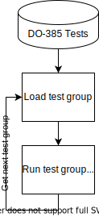
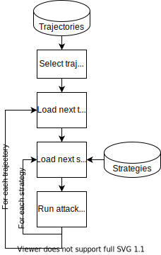
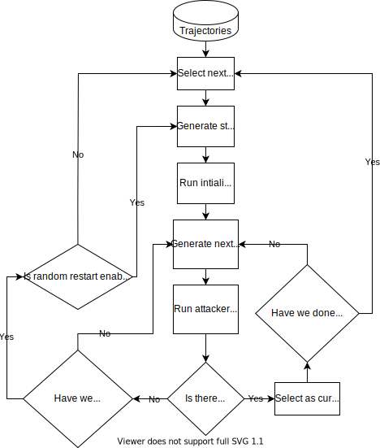
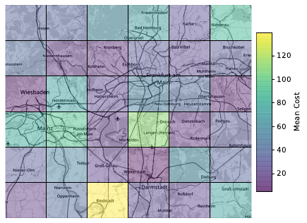
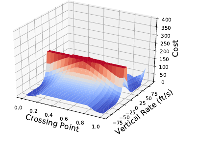
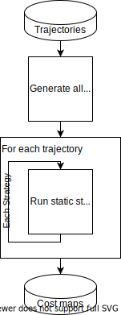

Simulator Technical Details
======================

This project implements a simulation wrapper around the standardised ACAS X code, as provided in DO-385. At a high level, it provides five modes of operation:

1. Run DO-385 tests
2. Run 'static attacker' trajectories
3. Run attacker optimisation
4. Run attacker grid analysis
5. Generate 'cost map' for a given trajectory

The sections below cover each mode, after a short introduction to the structure of the simulator.

## Simulator Architecture

As mentioned above, this simulator is built around the code provided by DO-385. The code isn't provided in source files, rather directly in the PDFs. It is also not written in a modular way beyond the STM and TRM components. This means that the code is quite messy. 

This code is also copyright, so should not be included in public versions of this repository. You can find the code in `code/standardised_code`.

We will now briefly cover each mode and what it does.

### Run DO-385 Tests

This mode runs all the prescriptive tests provided in the DO-385 standard. There is more detail on this [here](../usage/test_details). The operation of this mode is quite simple - it simply loads the tests and runs them all.

</img>

### Run Static Attacker Trajectories

This mode takes any strategies defined by the parameter `PARAM_DEFAULT_STRATEGIES` and runs them on a number of trajectories. 

</img>

### Run Attacker Optimisation

By default, this mode generates a random starting strategy then tries to optimise it, according to the cost function. The workings are a bit more complex, but at are described at a high level below.

</img>

### Run Attacker Grid Analysis

This mode uses the same concept as the optimiser above, but instead of only having two attacker positions, it allows you to specify the attacker being at whichever coordinate pair you like. We can use this to test a grid of coordinates around an airport for example, as below.

</img>

### Generate Cost Map

This mode generates a map of costs for a given trajectory, by iterating across all the possible attack strategies. The maps look like this.

</img>

A broad overview of the structure is below. Given a list of trajectories, the system generates all possible attacker strategies then runs each one on each trajectory. This produces a costmap for each trajectory.

</img>

## Other Questions

### Why Julia 0.3

You might be asking 'Why are you using Julia 0.3? That's super old!' You would be right.

Unfortunately, the code provided in DO-385 was written back in 2015 and used Julia 0.3. Since then, the Julia syntax and built-in method signatures have changed quite a lot. Furthermore, there is almost 10,000 lines of code across the STM and TRM modules. This makes upgrading the code to 1.1 a considerable task and one which I chose not to try.

Instead, I have kept the code as Julia 0.3 to keep it closer to the standard and make it easier to test.

### What does it implement?

The simulator implements all functionality from the DO-385 standard __except__ Mode C support. 

### Why no Mode C?

I chose to do this after spending a few weeks trying to come up with a config which allows Mode C tests to pass while all other tests also pass. I do not think this is possible with the current standardised code. If you are interested why, read on.

Mode C is implemented in two ways in DO-385:
* One method is to follow the same pattern as all the other inputs, e.g. Mode S. This involves processing every message one at a time, within each iteration.
* The other method is 'batch processing' which groups all the Mode C messages together in one iteration and processes them in one go. 
As far as I can tell, the simulator will fail prescriptive tests while in Mode C batch processing mode, but it will also fail non-prescriptive tests if you do not use batch Mode C processing. 

Since none of the experiments I carried out used Mode C, and Mode C is declared as optional in the standard, I decided to omit it and not run non-prescriptive tests.
